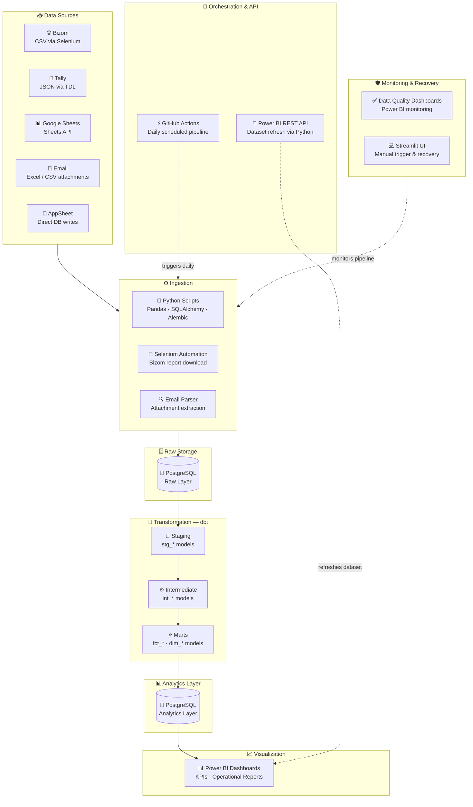

# 🏗️ End-to-End Data Platform

> A production-grade data engineering platform — multi-source ingestion, automated dbt transformations, CI/CD pipelines, API-based Power BI refresh, and enterprise-level monitoring.

---

## 📐 Architecture



---

## 📥 Data Sources

### 🔹 Bizom (CSV via Selenium)
- Automated browser-based report downloads using Selenium WebDriver
- Handles login, navigation, and CSV export end-to-end
- Scheduled as part of the daily GitHub Actions pipeline

### 🔹 Tally (JSON via TDL)
- Custom TDL (Tally Definition Language) scripts to export structured JSON
- Extracts vouchers, ledgers, and inventory data from Tally ERP
- Parsed and loaded into PostgreSQL via SQLAlchemy

### 🔹 Google Sheets (API)
- Connected via Google Sheets API using service account credentials
- Reads named ranges and sheets for planning and manual input data
- Incremental pulls based on last-modified timestamps

### 🔹 Email Attachments (Excel/CSV)
- Automated extraction of reports received via email
- Parsed attachments (Excel/CSV) using Python (`imaplib`, `openpyxl`, `pandas`)
- Integrated into the ingestion pipeline for unified processing

### 🔹 AppSheet (Direct DB Writes)
- AppSheet apps configured to write directly to PostgreSQL
- Real-time field data entry — no intermediate file transfer
- Schema managed via Alembic migrations

---

## ⚙️ Automation & Orchestration

Fully automated using **GitHub Actions** (daily scheduled runs via cron).

### 🔄 Pipeline Workflow

1. **Extract** data from all sources:
   - Bizom (CSV via Selenium)
   - Tally (JSON via TDL)
   - Google Sheets (API)
   - Email attachments (Excel/CSV)
   - AppSheet (direct DB writes)

2. **Transform & load** into PostgreSQL (Python + Pandas + SQLAlchemy)

3. **Run dbt transformations:**
   - Staging → Intermediate → Marts
   - Incremental models to minimize processing
   - Fact & dimension tables for analytics

4. **Trigger Power BI dataset refresh:**
   - Python script using Power BI REST API
   - OAuth token generation
   - Automated dataset refresh post-pipeline

---

### 🔁 Failure Handling

Built a **Streamlit interface** to:
- Manually trigger individual pipeline steps
- Re-run failed jobs without re-running the full pipeline
- Monitor pipeline execution status and logs in real time

---

## 🚀 CI/CD for dbt

Implemented a CI/CD pipeline for dbt models using **GitHub Actions**.

**Automated on every pull request:**
- `dbt compile` — validates all model SQL syntax
- `dbt test` — runs schema and data tests
- Schema validation against staging environment
- Deployment readiness checks before merge

**Ensures:**
- Consistent and tested data transformations
- Safe, reviewed updates to production models
- No breaking changes reach the analytics layer undetected

---

## 📊 Data Quality & Monitoring

Built data quality monitoring dashboards in **Power BI**, fed by dbt test results and pipeline metadata.

### Key Features
- Validation checks across all data sources (row counts, null rates, uniqueness)
- Detection of mismatches between source data and database
- Monitoring of pipeline health, freshness, and SLA adherence
- Alerts for unexpected schema changes or test failures

### Outcome
- Maintained **~98% data accuracy** across all sources
- Proactive error detection before reports are published
- Reduced manual data reconciliation effort significantly

---

## 🗄️ Data Storage

### Raw Layer — PostgreSQL
- All source data landed as-is (append-only, no transformation)
- Preserves full audit trail for reprocessing
- Schema managed by Alembic migrations

### Analytics Layer — PostgreSQL
- Populated by dbt mart models
- Query-ready fact and dimension tables
- Powers all Power BI dashboards

### dbt Layer Structure

| Layer | Models | Purpose |
|---|---|---|
| Staging | `stg_*` | Rename, cast, clean raw sources |
| Intermediate | `int_*` | Joins, business logic, reusable CTEs |
| Marts | `fct_*`, `dim_*` | Analytics-ready fact & dimension tables |

---

## ⚡ Key Features

- **Multi-source ingestion** — Bizom, Tally, Google Sheets, Email, AppSheet
- **Fully automated daily pipeline** via GitHub Actions
- **Incremental dbt transformations** — efficient, scalable models
- **CI/CD for dbt** — automated testing and safe deployments
- **API-based Power BI refresh** — no manual dashboard updates
- **Data quality monitoring dashboards** — 98%+ accuracy maintained
- **Manual fallback system** via Streamlit UI
- **Modular, scalable architecture** — each layer independently maintainable

---

## 🛠️ Tech Stack

| Category | Tools |
|---|---|
| Language | Python 3.x |
| Data processing | Pandas, SQLAlchemy, Alembic |
| Automation | Selenium WebDriver |
| Transformation | dbt (data build tool) |
| Database | PostgreSQL |
| Orchestration | GitHub Actions |
| Visualization | Power BI |
| API integration | Power BI REST API |
| Monitoring UI | Streamlit |
| Version control | Git / GitHub |

---

## 📁 Project Structure

```
├── ingestion/
│   ├── bizom/          # Selenium scripts for Bizom CSV download
│   ├── tally/          # TDL export + Python parser
│   ├── sheets/         # Google Sheets API connector
│   ├── email/          # Email attachment parser
│   └── appsheet/       # AppSheet DB write handler
├── dbt/
│   ├── models/
│   │   ├── staging/    # stg_* models
│   │   ├── intermediate/ # int_* models
│   │   └── marts/      # fct_* and dim_* models
│   ├── tests/
│   └── dbt_project.yml
├── powerbi/
│   └── refresh.py      # Power BI REST API dataset refresh
├── streamlit/
│   └── app.py          # Manual trigger & monitoring UI
├── .github/
│   └── workflows/
│       ├── pipeline.yml        # Daily scheduled pipeline
│       └── dbt_ci.yml          # dbt CI/CD on PRs
└── README.md
```

---

## 🚀 Getting Started

### Prerequisites
```bash
pip install pandas sqlalchemy alembic selenium dbt-postgres streamlit requests
```

### Environment Variables
```bash
# Database
POSTGRES_HOST=
POSTGRES_DB=
POSTGRES_USER=
POSTGRES_PASSWORD=

# Google Sheets
GOOGLE_SERVICE_ACCOUNT_JSON=

# Power BI
POWERBI_CLIENT_ID=
POWERBI_CLIENT_SECRET=
POWERBI_TENANT_ID=
POWERBI_DATASET_ID=
POWERBI_WORKSPACE_ID=
```

### Run Pipeline Manually
```bash
# Full pipeline
python ingestion/run_all.py

# dbt transformations only
cd dbt && dbt run && dbt test

# Power BI refresh only
python powerbi/refresh.py

# Launch Streamlit monitoring UI
streamlit run streamlit/app.py
```

---

## 📄 License

MIT License — see [LICENSE](LICENSE) for details.
