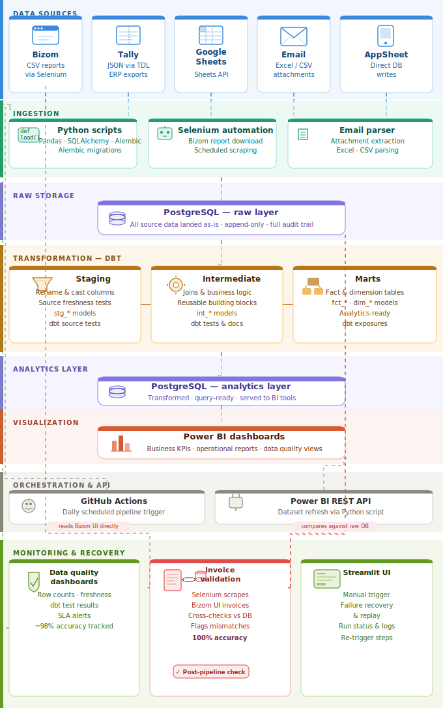

# 🏗️ End-to-End Data Platform

> A production-grade data engineering platform — multi-source ingestion, automated dbt transformations, CI/CD pipelines, API-based Power BI refresh, and enterprise-level monitoring with post-pipeline invoice validation.

---

## 📐 Architecture



**Flow:**
`Sources` → `Ingestion` → `PostgreSQL (Raw)` → `dbt (Staging → Intermediate → Marts)` → `PostgreSQL (Analytics)` → `Power BI`

**Orchestration:** GitHub Actions triggers the full pipeline daily · Power BI REST API refreshes datasets post-run

**Monitoring:** Invoice validation runs post-pipeline — Selenium reads Bizom UI and cross-checks against the raw DB independently

---

## 📥 Data Sources

### 🔹 Bizom (CSV via Selenium)
- Automated browser-based report downloads using Selenium WebDriver
- Handles login, navigation, and CSV export end-to-end
- Also used independently by the invoice validation module — reads the Bizom UI directly to cross-check what landed in the DB

### 🔹 Tally (JSON via TDL)
- Custom TDL (Tally Definition Language) scripts to export structured JSON
- Extracts vouchers, ledgers, and inventory data from Tally ERP
- Parsed and loaded into PostgreSQL via SQLAlchemy

### 🔹 Google Sheets (API)
- Connected via Google Sheets API using service account credentials
- Reads named ranges and sheets for planning and manual input data

### 🔹 Email Attachments (Excel/CSV)
- Automated extraction of reports received via email
- Parsed attachments using Python (`imaplib`, `openpyxl`, `pandas`)
- Integrated into the ingestion pipeline for unified processing

### 🔹 AppSheet (Direct DB Writes)
- AppSheet apps configured to write directly to PostgreSQL
- Real-time field data entry — no intermediate file transfer
- Schema managed via Alembic migrations

---

## ⚙️ Automation & Orchestration

Fully automated using **GitHub Actions** (daily scheduled runs via cron).

### 🔄 Pipeline Workflow

1. **Extract** from Bizom · Tally · Google Sheets · Email · AppSheet
2. **Load** into PostgreSQL raw layer (Python + Pandas + SQLAlchemy)
3. **Transform** with dbt — Staging → Intermediate → Marts
4. **Refresh** Power BI datasets via REST API (Python + OAuth)
5. **Validate** — invoice reconciliation module runs post-pipeline in monitoring layer

### 🔁 Failure Handling

Built a **Streamlit UI** to:
- Manually trigger individual pipeline steps
- Re-run failed jobs without re-running the full pipeline
- Monitor execution status and logs in real time

---

## 🚀 CI/CD for dbt

Implemented a CI/CD pipeline for dbt models using **GitHub Actions**.

**Automated on every pull request:**
- `dbt compile` — validates all model SQL syntax
- `dbt test` — runs schema and data tests
- Schema validation against staging environment

**Ensures:**
- Consistent and tested data transformations
- Safe, reviewed updates to production models
- No breaking changes reach the analytics layer undetected

---

## 📊 Data Quality & Monitoring

### ✅ Data Quality Dashboards (Power BI)
- Row counts, null rates, and uniqueness checks across all sources
- dbt test results surfaced as dashboard metrics
- SLA freshness monitoring and pipeline health tracking

### 🧾 Invoice Validation — Post-Pipeline Reconciliation

A dedicated **post-pipeline validation module** that runs inside the monitoring layer after ingestion completes:

- Uses **Selenium** to scrape invoice records directly from the live **Bizom UI**
- Compares scraped records against invoices already loaded into **PostgreSQL**
- Flags mismatches, missing entries, or data discrepancies
- Does **not block the pipeline** — acts as a post-load reconciliation check with alerting
- Achieved **100% invoice data accuracy** across all reconciliation runs

> It sits in monitoring (not ingestion) because the pipeline ingests first from the CSV exports, and this module then independently validates what landed in the DB against the live UI — two separate reads of Bizom for maximum accuracy assurance.

### Outcome
- **~98% overall data accuracy** across all sources
- **100% invoice accuracy** via dedicated reconciliation
- Reduced manual data reconciliation effort significantly

---

## 🗄️ Data Storage

| Layer | DB | Purpose |
|---|---|---|
| Raw | PostgreSQL | Landed as-is · append-only · full audit trail · used by invoice validator |
| Analytics | PostgreSQL | dbt mart output · query-ready · powers Power BI |

### dbt Model Structure

| Layer | Prefix | Purpose |
|---|---|---|
| Staging | `stg_*` | Rename, cast, clean raw sources |
| Intermediate | `int_*` | Joins, business logic, reusable CTEs |
| Marts | `fct_*`, `dim_*` | Analytics-ready fact & dimension tables |

---

## ⚡ Key Features

- Multi-source ingestion — Bizom, Tally, Google Sheets, Email, AppSheet
- Fully automated daily pipeline via GitHub Actions
- Incremental dbt transformations — efficient, scalable models
- CI/CD for dbt — automated testing and safe deployments
- API-based Power BI refresh — zero manual dashboard updates
- **Post-pipeline invoice validation** — Selenium reconciliation at 100% accuracy
- Data quality monitoring dashboards — ~98% accuracy maintained
- Manual fallback system via Streamlit UI
- Modular, scalable architecture — each layer independently maintainable

---

## 🛠️ Tech Stack

| Category | Tools |
|---|---|
| Language | Python 3.x |
| Data processing | Pandas, SQLAlchemy, Alembic |
| Automation | Selenium WebDriver |
| Transformation | dbt |
| Database | PostgreSQL |
| Orchestration | GitHub Actions |
| Visualization | Power BI |
| API integration | Power BI REST API |
| Monitoring UI | Streamlit |

---

## 📁 Project Structure

```
├── ingestion/
│   ├── bizom/              # Selenium CSV download
│   ├── tally/              # TDL export + parser
│   ├── sheets/             # Google Sheets connector
│   ├── email/              # Email attachment parser
│   └── appsheet/           # AppSheet DB handler
├── dbt/
│   ├── models/
│   │   ├── staging/
│   │   ├── intermediate/
│   │   └── marts/
│   └── dbt_project.yml
├── powerbi/
│   └── refresh.py          # REST API dataset refresh
├── monitoring/
│   └── invoice_validation/
│       └── validator.py    # Selenium reconciliation vs PostgreSQL
├── streamlit/
│   └── app.py              # Monitoring & manual trigger UI
├── .github/
│   └── workflows/
│       ├── pipeline.yml    # Daily pipeline
│       └── dbt_ci.yml      # dbt CI/CD on PRs
└── README.md
```

---

## 🚀 Getting Started

```bash
pip install pandas sqlalchemy alembic selenium dbt-postgres streamlit requests
```

```bash
# Full pipeline
python ingestion/run_all.py

# dbt only
cd dbt && dbt run && dbt test

# Power BI refresh
python powerbi/refresh.py

# Invoice validation (post-pipeline)
python monitoring/invoice_validation/validator.py

# Streamlit UI
streamlit run streamlit/app.py
```

---

## 📄 License

MIT License — see [LICENSE](LICENSE) for details.
